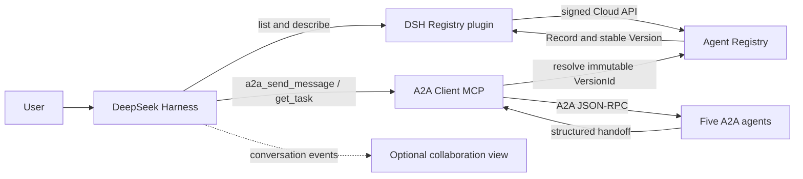

# Discover and orchestrate five A2A agents with Agent Registry

[中文](./README_zh.md)

This runnable example connects DeepSeek Harness (DSH) to Tencent Cloud Agent Registry. DSH discovers five governed A2A assets, resolves their stable versions, and invokes them through a small A2A Client MCP server. An optional DSH client plugin visualizes the collaboration.

The five example agents cover requirements, implementation, review, testing, and release readiness. Their descriptions and structured handoffs allow the DSH model to choose the next capability; there is no hard-coded five-step workflow in the coordinator.


*The complete collaboration interface shows the Registry-Coordinator-A2A topology, all five participating agents, five A2A task handoffs, and the live event stream in one unobstructed view. This validation run used an isolated `cbk-e2e-20260918a` name prefix.*

> This is a reference integration, not a built-in Agent Registry invocation mechanism. Agent Registry stores and governs asset metadata and stable versions. DSH performs discovery and orchestration; the A2A Client MCP server performs protocol invocation; five A2A handlers in the demo service execute the work.

## Architecture



The source included here has four parts:

- `src/` runs five A2A 1.0 agents and the A2A Client MCP server.
- `plugins/dsh-agent-registry/` exposes Registry discovery tools and first-turn candidate discovery to DSH.
- `plugins/dsh-collaboration-stage/` renders the collaboration view shown above. It is presentation-only.
- `scripts/` registers, smoke-tests, and cleans up the five demo records.

## Prerequisites

- Node.js 22 or later and pnpm 11.
- An OpenAI-compatible Chat Completions endpoint for the five worker agents.
- An existing `ACTIVE` Agent Registry in the same Region, using `AUTO` approval mode. Use a dedicated Registry for this demo.
- Tencent Cloud credentials allowed to call `DescribeRegistry`, `DescribeRegistryList`, `DescribeRegistryRecordList`, `DescribeRegistryRecord`, `CreateRegistryRecord`, and `UpdateRegistryRecord`. `DeleteRegistryRecord` is needed only for cleanup.
- A DSH instance on the same host as the demo services for the default localhost setup. To deploy DSH first, see the repository's [DeepSeek Harness Deployment Cookbook](../deployment-cookbook/deepseek-harness/README.md).

Use a dedicated sub-account or temporary credentials with only the required permissions. Do not use root-account credentials.

## 1. Install and configure

```bash
cd examples/agent-registry-multi-agent
make setup
cp .env.example .env
```

Edit `.env` and provide:

| Variable | Required | Purpose |
|---|---:|---|
| `TENCENTCLOUD_SECRET_ID` / `TENCENTCLOUD_SECRET_KEY` | Yes | Cloud API signing credentials. |
| `TENCENTCLOUD_TOKEN` | Only for temporary credentials | Session token sent as `X-TC-Token`. |
| `TENCENTCLOUD_REGION` | Yes | Registry Region, for example `ap-chongqing`. |
| `AGENT_REGISTRY_ID` | Yes | Existing dedicated AUTO Registry. |
| `AGENT_REGISTRY_ENDPOINT` | No | Defaults to `https://registry.tencentcloudapi.com/`. |
| `OPENAI_API_KEY` / `OPENAI_MODEL` | Yes | Worker-agent model credential and model name. |
| `OPENAI_BASE_URL` | Yes | OpenAI-compatible base URL; both `/v1` and a host root are accepted. |
| `DEMO_PUBLIC_BASE_URL` | No | A2A base URL stored in Registry. Defaults to `http://127.0.0.1:18080`. |
| `DEMO_RECORD_PREFIX` | No | Prefix for the five managed Record names. Defaults to `demo-rd`. |

The `.env` file is ignored by Git. Credentials are read at runtime and are never written to Agent descriptors.

## 2. Start the five agents and the MCP bridge

```bash
make run
```

Keep this terminal running. Expected startup output includes:

```text
[delivery-demo] 5 A2A agents ready at http://127.0.0.1:18080
[a2a-client-mcp] ready at http://127.0.0.1:18081/mcp
```

The default URLs are intentionally loopback-only. If DSH runs elsewhere, expose the A2A service through a URL reachable from that DSH host and set `DEMO_PUBLIC_BASE_URL` before registration. Do not publish an unauthenticated demo service to the internet.

## 3. Register the five A2A assets

In a second terminal, using the same `.env`:

```bash
make register
```

The command is idempotent for the five names matching `DEMO_RECORD_PREFIX`:

- a missing Record is created with an A2A Agent Card;
- an unchanged stable descriptor is left untouched;
- a changed descriptor creates an immutable Version and moves `stable` to the approved Version;
- unrelated Records are never modified.

Expect a JSON result containing exactly five entries and actions such as `CREATED` or `UNCHANGED`. You can also open the Agent Registry console and confirm that the five Records have an approved stable Version.

With the default `DEMO_RECORD_PREFIX=demo-rd`, the five governed A2A assets appear together in the Registry console, each in normal status:


Run the direct A2A smoke test before involving DSH:

```bash
DEMO_AGENT=requirements make smoke
```

Remove `DEMO_AGENT=requirements` to invoke all five agents. This consumes model tokens.

## 4. Install the DSH plugins

The example assumes an existing DSH `web` profile. Stop DSH before changing that profile, then run from this example directory:

```bash
export DSH_PROFILE_DIR="${DSH_HOME:-$HOME/.dsh}/profiles/web"

pnpm --dir "$DSH_PROFILE_DIR" add \
  @deepseek-ai/dsh-mcp-client@0.0.1-rc.1 \
  "@local/dsh-agent-registry@link:${PWD}/plugins/dsh-agent-registry" \
  "@local/dsh-collaboration-stage@link:${PWD}/plugins/dsh-collaboration-stage"
```

Merge the entries from [`dsh.cordis.patch.yml`](./dsh.cordis.patch.yml) into the profile's existing `cordis.patch.yml`. Do not overwrite unrelated profile settings.

Provide the Registry variables to the DSH process through its environment:

```text
TENCENTCLOUD_SECRET_ID
TENCENTCLOUD_SECRET_KEY
TENCENTCLOUD_TOKEN          # only for temporary credentials
TENCENTCLOUD_REGION
AGENT_REGISTRY_ID
AGENT_REGISTRY_ENDPOINT
```

Do not place credentials in `cordis.patch.yml`. Restart DSH using the same method used by your deployment. The MCP URL in the supplied patch is `http://127.0.0.1:18081/mcp`, so DSH and `make run` must share a network namespace or host. Change it when they do not.

The Registry plugin was built against the DSH tool API used by this cookbook. The collaboration-stage plugin relies on DSH browser extension points and is optional: if the visualization is incompatible with a different DSH build, remove only `client-collaboration-stage`; discovery and invocation remain usable.

## 5. Run the end-to-end collaboration

Open DSH, configure its own model provider, start a new conversation, and use a prompt that requires a complete delivery loop. For example:

```text
Create a single-file HTML task board in the current workspace. Complete requirements analysis,
implementation, independent code review, real executable testing, and final delivery acceptance.
Use appropriate governed capabilities discovered from Agent Registry, preserve evidence between
handoffs, and do not claim a test or release that did not actually happen.
```

Expected behavior:

1. At the first step, the Registry plugin lists visible active Registries and supplies matching candidates to DSH.
2. DSH describes a selected Record and obtains its exact stable `VersionId`.
3. DSH invokes that immutable target through `a2a_send_message`, then polls `a2a_get_task` when needed.
4. Each agent returns a human-readable report plus a structured `nextRecommendedCapability` handoff.
5. DSH decides whether to invoke the next capability and performs workspace operations or tests with its own tools.

The collaboration view should show five unique participating agents. The A2A task count can exceed five when review or testing sends work back for revision; protocol-level `TASK_STATE_COMPLETED` also does not mean the business outcome passed, so DSH must inspect `handoff.outcome`.

DSH also turns the requested delivery loop into an explicit task checklist. In the verified run, all seven generated tasks completed, including discovery, five role handoffs, and evidence aggregation:


The final answer should preserve the immutable `RecordId`, `VersionId`, and A2A `TaskId` for every handoff, alongside the business result. This turns the conversation into an inspectable delivery trail rather than an unverified chain of model messages.

## Cleanup

Stop `make run`, then delete only this example's five Records:

```bash
make cleanup
```

The cleanup script requires `CONFIRM_DELETE=yes` (the Make target sets it), matches the current `DEMO_RECORD_PREFIX`, and does not delete the Registry or unrelated Records. Record deletion currently has no public recovery API.

Remove the three example dependencies and the three patch entries from the DSH profile if they are no longer needed.

## Troubleshooting

- `Registry ... uses MANUAL approval`: use a dedicated AUTO Registry for this path, or create and approve the five assets manually before DSH discovery.
- `UnauthorizedOperation`: verify Region, Registry ID, sub-account policy, and temporary credential token.
- Discovery returns candidates but invocation fails: the descriptor URL is reachable from the machine that ran `make register`, not necessarily from DSH. Update `DEMO_PUBLIC_BASE_URL`, rerun `make register`, and confirm the new stable Version.
- `a2a_get_task` never completes: inspect the `make run` terminal and verify the OpenAI-compatible endpoint, model name, timeout, and token limits.
- No collaboration panel: remove or update the optional visualization plugin; verify discovery through the Registry tool calls before debugging the UI.

## Validation

The non-cloud test suite uses local servers and mocked Cloud API/model responses:

```bash
make test
```

`make register`, `make smoke`, and the DSH conversation are credentialed integration steps and can create cloud Records or consume model tokens. Run them only in the dedicated demo Registry.
