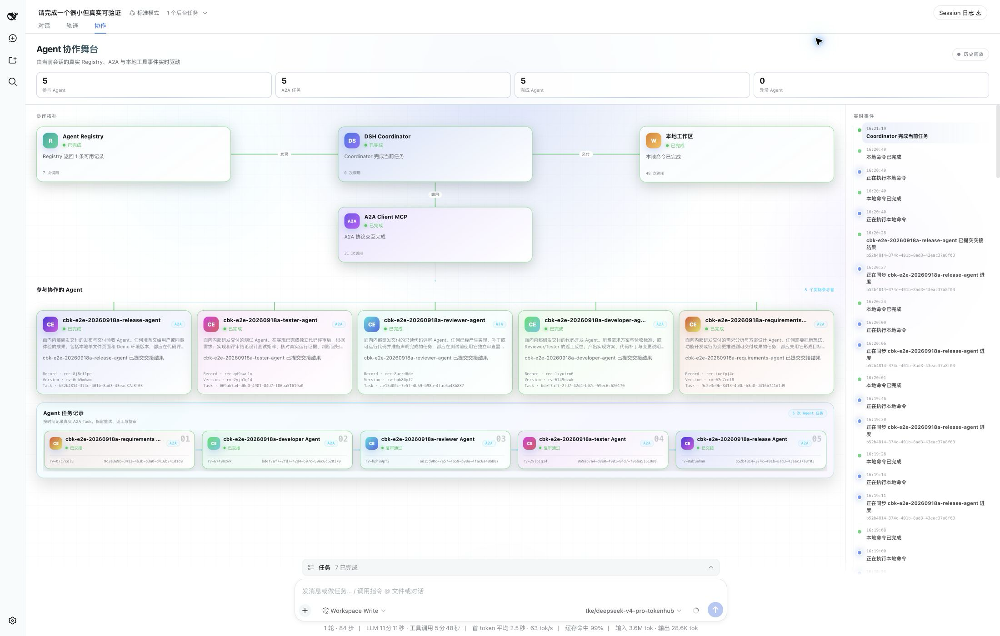
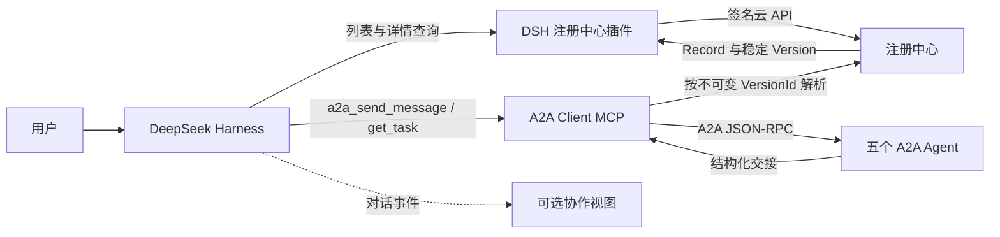
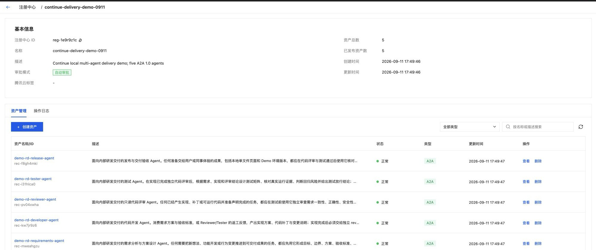
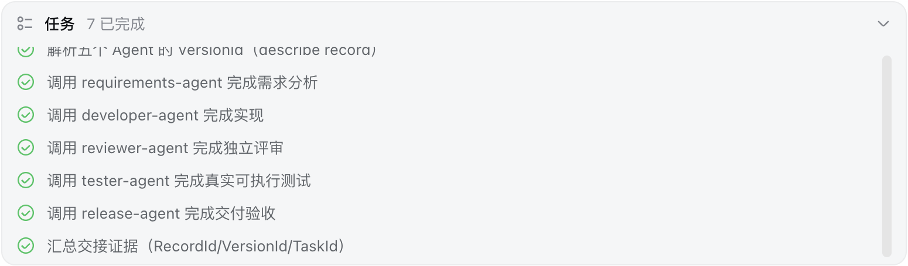

# 使用注册中心发现并协作调用五个 A2A Agent

[English](./README.md)

本示例将 DeepSeek Harness（DSH）接入腾讯云注册中心。DSH 从注册中心发现五个受治理的 A2A 资产，解析其稳定版本，并通过一个轻量的 A2A Client MCP 服务调用这些 Agent；可选的 DSH 客户端插件用于展示协作过程。

五个示例 Agent 分别负责需求分析、代码开发、代码评审、测试判定和发布验收。DSH 模型根据资产描述和结构化交接决定下一步使用哪个能力，Coordinator 中没有写死五步工作流。



*完整协作界面在一张图中展示注册中心—Coordinator—A2A 拓扑、五个实际参与的 Agent、五次 A2A 任务交接和实时事件，底部没有遮挡。本次隔离验证使用了 `cbk-e2e-20260918a` 名称前缀。*

> 这是参考接入示例，不是注册中心内置的统一调用能力。注册中心负责保存和治理资产元数据与稳定版本；DSH 负责发现与编排；A2A Client MCP 负责协议调用；演示服务中的五个 A2A 处理器负责实际执行。

## 架构



示例源码分为四部分：

- `src/`：运行五个 A2A 1.0 Agent 和 A2A Client MCP 服务。
- `plugins/dsh-agent-registry/`：向 DSH 提供注册中心发现工具，并在每个新目标的第一步提供候选资产。
- `plugins/dsh-collaboration-stage/`：渲染上图所示的协作界面，仅属于展示层。
- `scripts/`：注册、冒烟验证和清理五个演示 Record。

## 前置条件

- Node.js 22 或更高版本，pnpm 11。
- 一个供五个工作 Agent 使用的 OpenAI-compatible Chat Completions 接入点。
- 同地域内一个状态为 `ACTIVE`、审批方式为 `AUTO` 的现有注册中心。建议为本示例单独创建注册中心。
- 腾讯云凭据至少可调用 `DescribeRegistry`、`DescribeRegistryList`、`DescribeRegistryRecordList`、`DescribeRegistryRecord`、`CreateRegistryRecord` 和 `UpdateRegistryRecord`；只有执行清理时才需要 `DeleteRegistryRecord`。
- 默认 localhost 路径要求 DSH 与演示服务运行在同一台机器上。如需先部署 DSH，请参考仓库中的 [DeepSeek Harness Deployment Cookbook](../deployment-cookbook/deepseek-harness/README_zh.md)。

请使用仅授予必要权限的专用子账号或临时凭据，不要使用主账号凭据。

## 1. 安装与配置

```bash
cd examples/agent-registry-multi-agent
make setup
cp .env.example .env
```

编辑 `.env`：

| 环境变量 | 是否必填 | 说明 |
|---|---:|---|
| `TENCENTCLOUD_SECRET_ID` / `TENCENTCLOUD_SECRET_KEY` | 是 | 云 API 签名凭据。 |
| `TENCENTCLOUD_TOKEN` | 使用临时凭据时 | 通过 `X-TC-Token` 传递的会话令牌。 |
| `TENCENTCLOUD_REGION` | 是 | 注册中心所在地域，例如 `ap-chongqing`。 |
| `AGENT_REGISTRY_ID` | 是 | 已存在的专用 AUTO 注册中心。 |
| `AGENT_REGISTRY_ENDPOINT` | 否 | 默认 `https://registry.tencentcloudapi.com/`。 |
| `OPENAI_API_KEY` / `OPENAI_MODEL` | 是 | 工作 Agent 使用的模型凭据和模型名。 |
| `OPENAI_BASE_URL` | 是 | OpenAI-compatible 基础地址，既可填写 `/v1`，也可填写主机根地址。 |
| `DEMO_PUBLIC_BASE_URL` | 否 | 写入注册中心描述信息的 A2A 基础地址，默认 `http://127.0.0.1:18080`。 |
| `DEMO_RECORD_PREFIX` | 否 | 五个受管 Record 的名称前缀，默认 `demo-rd`。 |

`.env` 已被 Git 忽略。凭据只在运行时读取，不会写入 Agent 描述信息。

## 2. 启动五个 Agent 与 MCP 桥接服务

```bash
make run
```

保持该终端运行。正常启动时会看到：

```text
[delivery-demo] 5 A2A agents ready at http://127.0.0.1:18080
[a2a-client-mcp] ready at http://127.0.0.1:18081/mcp
```

默认地址仅监听 loopback。如果 DSH 运行在其他主机上，需要将 A2A 服务暴露到 DSH 可访问的地址，并在注册前设置 `DEMO_PUBLIC_BASE_URL`。不要把未鉴权的演示服务直接暴露到公网。

## 3. 注册五个 A2A 资产

在第二个终端执行：

```bash
make register
```

该命令只管理名称匹配 `DEMO_RECORD_PREFIX` 的五个 Record，并可重复执行：

- Record 不存在时，使用 A2A Agent Card 创建；
- 稳定版本描述信息没有变化时，不做修改；
- 描述信息变化时，创建不可变的新 Version，并把 `stable` 移到已审批的新版本；
- 不修改其他 Record。

预期得到包含五项结果的 JSON，`action` 为 `CREATED`、`UNCHANGED` 等。也可以在注册中心控制台确认五个 Record 均已有 Approved 的稳定版本。

使用默认的 `DEMO_RECORD_PREFIX=demo-rd` 时，五个受治理的 A2A 资产会集中显示在注册中心控制台中，状态均为正常：



接入 DSH 前，先直接验证 A2A 服务：

```bash
DEMO_AGENT=requirements make smoke
```

去掉 `DEMO_AGENT=requirements` 会依次调用全部五个 Agent，并消耗相应模型 Token。

## 4. 安装 DSH 插件

以下步骤假设已有 DSH `web` profile。先停止 DSH，然后在本示例目录执行：

```bash
export DSH_PROFILE_DIR="${DSH_HOME:-$HOME/.dsh}/profiles/web"

pnpm --dir "$DSH_PROFILE_DIR" add \
  @deepseek-ai/dsh-mcp-client@0.0.1-rc.1 \
  "@local/dsh-agent-registry@link:${PWD}/plugins/dsh-agent-registry" \
  "@local/dsh-collaboration-stage@link:${PWD}/plugins/dsh-collaboration-stage"
```

把 [`dsh.cordis.patch.yml`](./dsh.cordis.patch.yml) 中的条目合并到该 profile 已有的 `cordis.patch.yml`，不要覆盖其他配置。

通过 DSH 进程的运行环境提供以下变量：

```text
TENCENTCLOUD_SECRET_ID
TENCENTCLOUD_SECRET_KEY
TENCENTCLOUD_TOKEN          # 仅临时凭据需要
TENCENTCLOUD_REGION
AGENT_REGISTRY_ID
AGENT_REGISTRY_ENDPOINT
```

不要把凭据写进 `cordis.patch.yml`。按原部署方式重启 DSH。示例 patch 中的 MCP 地址是 `http://127.0.0.1:18081/mcp`，因此 DSH 与 `make run` 需要共享主机或网络命名空间；否则需要修改该地址。

注册中心插件基于本 Cookbook 使用的 DSH tool API 编写。协作界面插件依赖 DSH 浏览器扩展点，因此是可选的：如果其他 DSH 版本与该界面不兼容，只移除 `client-collaboration-stage` 即可，资产发现与调用链路仍可使用。

## 5. 跑通端到端协作

打开 DSH，配置 DSH 自身使用的模型提供方，新建对话并输入一个需要完整交付闭环的任务。例如：

```text
请在当前工作区创建一个单文件 HTML 任务看板，完成需求分析、实现、独立代码评审、
真实可执行测试和最终交付验收。请使用注册中心发现的合适受治理能力，在交接之间保留证据，
不要声称执行了实际未运行的测试或发布。
```

预期链路如下：

1. 新目标开始时，注册中心插件查询可访问的 ACTIVE 注册中心，把匹配的候选资产提供给 DSH。
2. DSH 读取选中 Record 的详情，获得明确的稳定 `VersionId`。
3. DSH 通过 `a2a_send_message` 调用不可变目标，必要时再用 `a2a_get_task` 查询结果。
4. 每个 Agent 返回给人阅读的报告和包含 `nextRecommendedCapability` 的结构化交接。
5. DSH 判断是否继续调用下一个能力，并使用自身工具完成工作区写入或真实测试。

协作界面应显示五个不同的参与 Agent。发生评审返工或测试证据不足时，同一角色可能被再次调用，因此 A2A Task 数量可能大于五。协议层的 `TASK_STATE_COMPLETED` 也不等于业务结论通过，DSH 还必须检查 `handoff.outcome`。

DSH 还会把本次交付闭环拆成明确的任务清单。本次验证中，资产解析、五个角色交接和证据汇总共七项任务全部完成：



最终回答应为每次交接保留不可变的 `RecordId`、`VersionId` 和 A2A `TaskId`，并同时给出业务结论。这样，一次协作不只是模型消息的串联，而是一条可以检查的交付证据链。

## 清理

停止 `make run` 后，删除本示例创建的五个 Record：

```bash
make cleanup
```

清理脚本要求 `CONFIRM_DELETE=yes`（Make target 会设置），只匹配当前 `DEMO_RECORD_PREFIX`，不会删除注册中心或无关 Record。目前 Record 删除没有公开恢复 API。

不再使用本示例时，还可以从 DSH profile 中移除三个示例依赖和三个 patch 条目。

## 常见问题

- `Registry ... uses MANUAL approval`：本路径需要专用 AUTO 注册中心；或者改为手工创建并审批五个资产，再让 DSH 发现。
- `UnauthorizedOperation`：检查地域、Registry ID、子账号策略和临时凭据 Token。
- 能发现资产但调用失败：写入描述信息的地址可能只对执行 `make register` 的机器可达，而 DSH 不可达。修改 `DEMO_PUBLIC_BASE_URL`、重新执行注册，并确认新稳定版本。
- `a2a_get_task` 长时间不结束：查看 `make run` 终端，检查 OpenAI-compatible 地址、模型名、超时与 Token 上限。
- 没有协作界面：先移除或更新可选展示插件，并通过 Registry 工具调用确认发现链路正常，再排查 UI。

## 验证

非云端测试使用本地服务及模拟的云 API、模型响应：

```bash
make test
```

`make register`、`make smoke` 和 DSH 对话属于带凭据的集成步骤，可能创建云上 Record 或消耗模型 Token；请只在专用演示注册中心中执行。
